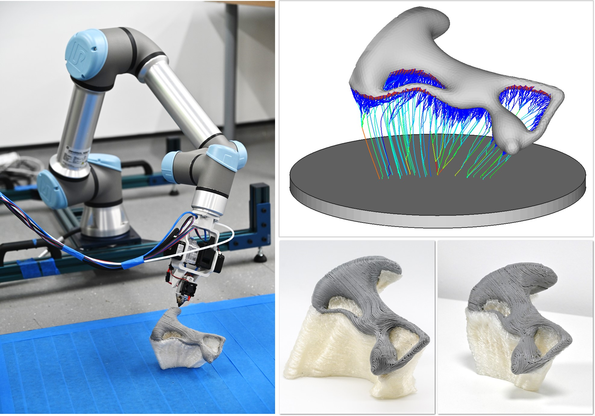
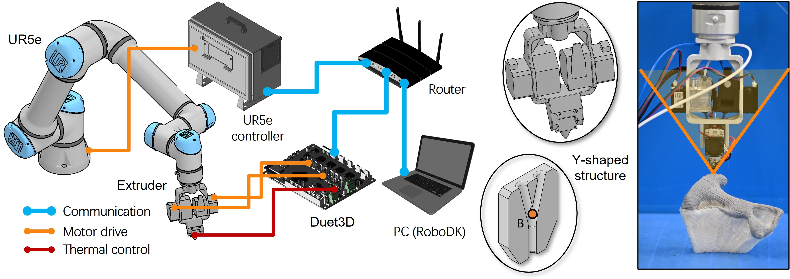

# Support_Generation_for_Curved_RoboFDM 
Support Generation for Robot-Assisted 3D Printing with Curved Layers. [paper link](https://arxiv.org/abs/2302.05510)

## Installation

Please compile the code with QMake file ## **Support_Generation_for_Curved_RoboFDM.pro**

**Platform**: 
	Windows + Visual Studio 2019 + QT-plugin (tested QT version: 5.12.3 + msvc2017_64)

**Install Steps**: 
- **Install Visual Studio Extension plug-in (QT VS Tool)** to open the .pro file and generate the project
- **Set 'shapeLab' as the start up project**
- **Enable OpenMP to get best performace** at: ShapeLab Project Property -> 'Configuration Proerties' -> c/c++ -> Language -> Open MP Support -> Select 'Yes (/openmp)'
- **Open Console** at: ShapeLab Project Property -> 'Configuration Proerties' -> Linker -> System -> Select 'Console (/SUBSYSTEM:CONSOLE)' in 'SubSystem'

## Usage

**Step 1: **
Click button '**1. Read Data**'.

- The tetrahedron model and scalar field will be loaded. There are four models are prepared with name as "connector2", "bridge", "topopt" and "dome"

- Input the needed value in the boxs for modification (there are already pre-setted)
Click button '**Update**'.

- The initially loaded model might be not in the appropriate position or orientation.

- The boxes for **Xm**, **Ym** and **Zm** means the 'move' along the corresponding axis for the input milimeters.

- The boxes for **Xr**, **Yr** and **Zr** means the 'rotation' around the corresponding axis for the input degree angle.

**Step 2:  **
Click button '**2. Read Support Space**'.
- The envelop of model will be loaded, which is compatible with model and the boundary is stritly aligned togather.

**Step 3:  **
Click button '**3. Transfer Field to Support Space**'.
- The field information will be transfered on the the envelop of model by extrapolation.

**Step 4:  **
Click button '**4. Layer generation**'.
- The compatible layers will be generated and the number of model layer is decided by **layer num**.

### Close the UI

**Step 5:  **
- Remesh the surface layer ( python + meshlab 2022.02 ) 
-- source directory: ../DataSet/temp/remesh/compatible_layers
-- double click "remesh.py" to do remesh
-- So, the files of the layers (.obj) for the model will be saved in the following folder
'../DataSet/temp/remesh/compatible_layers/output'

### Run code again

**Step 1: **
Click button '**1. Read Data**'.

- The tetrahedron model and scalar field will be loaded. Read the same model as previous part. Then click button '**Update**'.

**Step 2: **
Click button '**2. Generate Support Skeleton**'.
- The tree skeleton will be generated from the overhang faces of model and converted to the bottom.

**Step 3: **
Click button '**3. Extract Slim Support Layers**'.
- The slimed support will be generateed according to the tree skeleton shape.

**remesh: **
- Remesh the surface layer ( python + meshlab 2022.02 ) 
-- source directory: ../DataSet/temp/remesh/slimed_layers
-- double click "remesh.py" to do remesh
-- So, the files of the layers (.obj) for the model will be saved in the following folder
'../DataSet/temp/remesh/slimed_layers/output'

**Step 4: **
Click button '**4. Contour Toolpath Generation**'.
- input **width** and **distance** in the boxes 

**for 'Display'**

- By inputting the number of layer in the 'show' box, It will display the layers from 0 to the inputted number.

- By ticking the checkbox **each**, it will only display the individual layer of the inputted number.

- By clicking the button ** All**, it will display the whole model.

**remesh:**

- Remesh the surface layer ( python + meshlab 2022.02 ) to make the layer sparse and speed up the calculation of layer height for extrusion volume calculation
-- source directory: ../DataSet/temp/robotWpGeneration; 
-- double click "copy_and_remesh.py" to do remesh.
-- So, the files of the layers (.obj) for the model will be saved in the following folder
'../DataSet/FABRICATION/_modelName_/layer_Simplified'

- In the '**Model**' box, input the folder name of the needed model, which is stored at :
 '**../DataSet/temp/robotWpGeneration/layer_Simplified**' and '**../DataSet/temp/robotWpGeneration/TOOL_PATH**'
 
 **Step 5:**
Click button '**5. Waypoint generation UR5e**'.
- The code which contains the position, normal of waypoints and extrustion volume and material information. It is used for the [UR](https://www.universal-robots.com/) robot.

## Curved Layer Generation Algorithm

[Tianyu Zhang](https://www.linkedin.com/in/tianyu-zhang-49b8231b5/), Guoxin Fang, Yuming Huang, Neelotpal Dutta, Sylvain Lefebvre, Zekai Murat Kilic, and [Charlie C.L. Wang](https://mewangcl.github.io/), [*ACM Transactions on Graphics (SIGGRAPH Asia 2022)*, vol.41, no.6, article no.277 (15 pages), December 2022](https://dl.acm.org/doi/10.1145/3550454.3555516)

## Hardware

Please refer to [link](https://github.com/yuminghuang1995/Hardware_support_for_Curved_RoboFDM) for more details.

